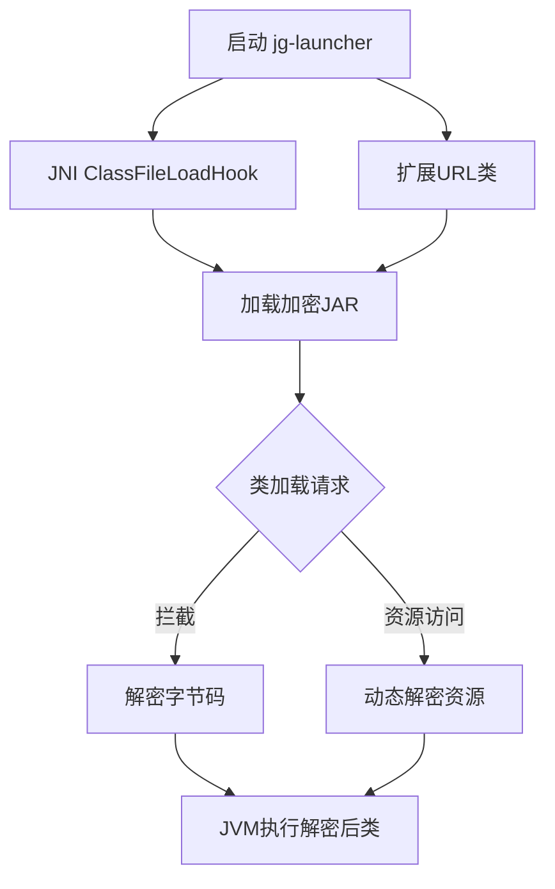

# jg-launcher 🔐
[](https://rust-lang.org)
[](LICENSE)
[](https://github.com/kyle-derrick/java-guard)

> 专为 Java Guard 设计的轻量级 Native 启动器，通过拦截 `ClassFileLoadHook` 实现运行时动态解密，保护加密 JAR 免受反编译和代码窃取。
> 
> 注意：需配合 [Java Guard 加密工具](https://github.com/kyle-derrick/java-guard) 使用
> 
> 编译需要 stable Rust（项目使用 Rust 2021 edition）和 JDK；请通过 `JAVA_HOME` 指定 JDK 路径。
> 

### 1. **工作流程图**


### 2. **与 Java Guard 集成**
```markdown
## 🔗 Java Guard 集成
jg-launcher 需配合 [Java Guard 加密工具](https://github.com/kyle-derrick/java-guard) 使用：
1. 使用 `java-guard` 加密原始 JAR
2. 通过 `jg-launcher` 启动加密后的 JAR
```

### 3. **贡献指南**
```markdown
## 🤝 如何贡献
- 报告问题: [Issues](https://github.com/kyle-derrick/jg-launcher/issues)
- 提交 PR: 遵循 Rust 编码规范，附带单元测试
- 安全漏洞: 请邮件至 feng.kyle@outlook.com
```